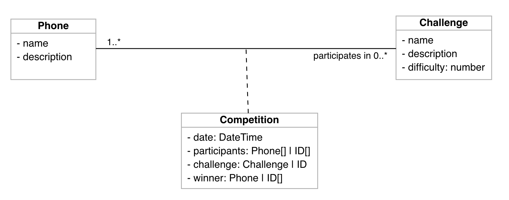

# Middle Stage Phone PK

The field test includes a .Net middle-end server that deligates requests to the upstream backend by [Squidex][squidex].

It provides GraphQL endpoints for front-end to interact with.

## Data model

https://online.visual-paradigm.com/share.jsp?id=3339333830332d38

## Dependencies

(todo)

## Deployment

(todo)

## Further Development

(todo)

<!-- Links -->
[squidex]: https://squidex.io/
