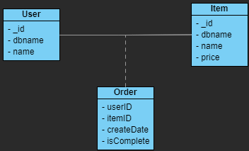

# mongo-class-model
Class-based MongoDB Models.

The example models in this cog are based upon following class diagram:


## Prerequisites

### Dependencies

``` jsonc
{
  "dependencies": {
    "@typegoose/typegoose": "^7.3.4",
    "mongoose": "^5.10.2"
  },
  "devDependencies": {
    "@types/mongoose": "^5.7.36",
    "typescript": "^4.0.2",
  }
}
```

### tsconfig

``` jsonc
{
  "compilerOptions": {
    "target": "es6",
    "emitDecoratorMetadata": true,
    "experimentalDecorators": true,
  }
}
```

## Test
- Fill out `example.json` under `configs` folder according to your environment
- run `npm run test` or equivalent commands.